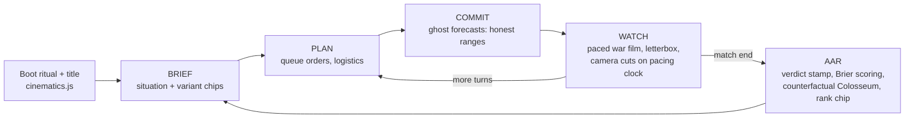
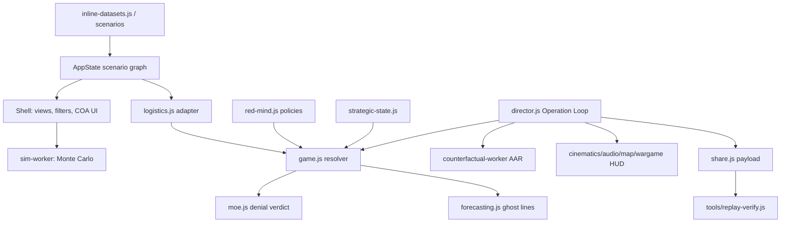

# StrikeSim 2040 Architecture Documentation

UNCLASSIFIED // NOTIONAL RESEARCH TOOL

## 1. How to Read This Document

This is the architectural ground truth for StrikeSim 2040, maintained under the TRIP workflow (`docs/ARCHI-rules.md` governs updates). Sections 2–7 describe the project universally; sections 8–16 cover game/simulation specifics; sections 17–23 cover cross-cutting strategy. Audience: any agent or engineer planning, implementing, or reviewing changes. The design spine (`docs/GAME_DESIGN.md`) and model docs (`docs/*_MODEL.md`, `docs/RED_MIND.md`, `docs/METHODOLOGY.md`) remain the authority on *why*; this document is the authority on *what exists and how it fits together*.

## 2. Overview

StrikeSim 2040 is a browser-based, offline-capable, multi-domain strike-planning **wargame** (formerly "MDSC 3D Network Visualizer"). It renders a Blue-vs-Red West Pacific 2040 battlespace as an interactive 3D force graph, overlays it on 2D geography with MIL-STD-2525-flavored symbology, runs seeded Monte Carlo course-of-action simulations, and — as its front door — presents **the Operation Loop**: a cinematic BRIEF → PLAN → COMMIT → WATCH → AAR turn-based game against a game-theoretic Red opponent. Victory is a denial Measure-of-Effectiveness (halt/culminate/capitulate the Red cross-strait operation), not attrition.

Two hard identities shape everything:

1. **One deterministic resolver.** `game.js` owns all combat/victory math. Forecasts, counterfactuals, the balance gate, and share-link replay verification all re-run that same resolver under a seed. Determinism is also the anti-cheat.
2. **Offline-complete.** No build step, no package manager, no runtime network calls. Every library is vendored; the one file allowed to differ between offline and hosted builds is `online-flags.js`.

## 3. Technology Stack

| Layer | Choice | Notes |
|---|---|---|
| Language | Vanilla JavaScript (no transpile, no types) | Plain `<script>` modules on `window`; runs over `file://` or any static server |
| Shell | `StrikeSim2040.html` (~6,500 lines) | Markup, styles, orchestration glue, COA UI, Monte Carlo engine |
| 3D | Three.js r128 + 3d-force-graph + OrbitControls (vendored) | r128 pin: no `CapsuleGeometry` (r142+) |
| 2D map | Leaflet 1.9.4 (vendored) | Optional local tiles `./tiles/{z}/{x}/{y}.png`, honest fallback badge |
| Charts/DOM | D3 v7 (vendored) | Task-org chart, data table |
| Symbology | `symbols.js` (dependency-free inline SVG) + vendored milsymbol | MIL-STD-2525 / APP-6 flavored |
| Workers | `sim-worker.js`, `counterfactual-worker.js` | Monte Carlo + AAR ensembles off the main thread |
| Tooling runtime | Node.js (any modern) | `tools/*.js` proof harnesses, balance gate, replay verifier — no npm install |
| Persistence | `localStorage` only | `strikesim.co006.settings` (cinematics-owned) |
| Versioning | None yet — TRIP starts at **0.1.0** | Git tags going forward (`vx.y.z`); existing tag `pre-stark-baseline` |

## 4. Project Structure

```
Strike Sim/
├── StrikeSim2040.html      # App shell + core Monte Carlo sim engine (entry point)
├── Open StrikeSim 2040*.command  # Double-click launchers (static server on :8000+)
│
│  # Engine & game layer
├── game.js                 # THE resolver: turn-based War Game engine (GameModule)
├── strategic-state.js      # Pure strategic-state mechanics (no browser/clock/random)
├── red-mind.js             # Red policy primitives: Harsanyi types, level-k/QRE, regret matching
├── forecasting.js          # Measured-judgment primitives (ghost forecasts, Brier/BSS)
├── moe.js                  # Denial MOE victory engine (halt/culminate/capitulate)
├── counterfactual.js/-worker.js  # AAR matched-pair & ensemble machinery
├── logistics.js            # Deterministic contested-logistics adapter (stocks/hubs/routes/DDIL)
│
│  # Presentation & UI layer
├── director.js             # Operation Loop phase machine (BRIEF→PLAN→COMMIT→WATCH→AAR)
├── cinematics.js           # Boot ritual, title front door, letterbox, settings store
├── audio.js                # AudioFXModule: 4 buses, gesture unlock, drone beds, stingers
├── wargame.js              # Self-contained War Game HUD (talks only to GameModule)
├── map.js / engine.js / views.js / symbols.js / stage.js  # Map, 3D, table/task-org, symbology, resize/reliability
├── ui.js / state.js / sim.js     # Toasts+log, scenario-centric AppState, seeded RNG + sim foundation
├── campaign.js             # NDS campaign layer (launcher hidden pending rebuild)
├── share.js / online-flags.js    # Challenge/replay links; THE one swappable build file
│
│  # Data & verification
├── inline-datasets.js      # Startup auto-loader for bundled Red/Blue networks
├── scenarios/ + schemas/   # Scenario JSON variants + JSON schema
├── tools/                  # Proof harnesses, balance gate/eval, replay-verify, builders
├── loop.run.yaml + loop-runs/ + loop-specs/  # Balance-calibration loop config & runs
│
│  # Docs & workflow
├── docs/                   # Design spine, model docs, METHODOLOGY + TRIP docs (1-plans…6-memo)
├── change-orders/          # CO-001…CO-007: plan-of-record change orders + progress ledgers
├── program-briefs/ reviews/ sandbox/  # Program framing, persona reviews, experiments
├── site/ site-preview/     # Nested repo: parked hosted layer (NEVER deploy until hosting decision)
├── _codex_review/ _CODEX Ideas/ _GEMINI Ideas/ _stark/ _fable/  # Agent workspaces & catalogs
├── .agents/skills/         # TRIP + codex skills (.claude/skills → symlinks here)
├── assets/ vendor/ milsymbol/    # Earth textures/geojson; vendored libraries
└── skills-lock.json        # TRIP workflow install pin (PiLastDigit/TRIP-workflow)
```

## 5. Core Architecture Principles

1. **No build, global modules.** Each module publishes `window.<Name>Module` and aliases public methods onto legacy global names (e.g. `window.refreshMapMarkers = MapModule.refreshMapMarkers`) so old call sites keep working.
2. **Dependency injection for shared state.** The shell injects live getters via `Module.init({...})`; modules never reach into shell scope directly. Graph access goes through `AppState.activeGraph()`.
3. **One resolver, no forks.** All adjudication lives in `game.js`. Ghost forecasts, counterfactuals, gate, and replay reuse it. `docs/GAME_DESIGN.md` §9 anti-goals are **binding**: no prediction theater, no chrome that doesn't serve a loop phase, no new top-level modes, no engine forks.
4. **Seeded determinism everywhere.** `SimModule` seeded RNG; deterministic pacing clock for WATCH; same seed + same order log ⇒ byte-identical outcome. This is the basis of share links, anti-cheat, and the proof harnesses.
5. **Purity layering for testability.** `strategic-state.js`, `red-mind.js`, `forecasting.js`, `counterfactual.js` own no browser/clock/storage/random state — Node can load them headlessly (proof harnesses depend on this).
6. **Presentation is presentation-only.** `audio.js`/`cinematics.js` have zero engine reach and zero network; they read state, never mutate it.
7. **Honest uncertainty.** Ranges instead of point predictions; player judgment scored with Brier/BSS against the house line.
8. **Everything stamped** UNCLASSIFIED // NOTIONAL.

## 6. Build System & Toolchain

There is deliberately **no build system**. Development loop:

```bash
python3 -m http.server 8000          # or any static server; .command files automate this
open http://localhost:8000/StrikeSim2040.html
```

Node.js runs the verification tooling directly from the repo root (no dependencies to install):

```bash
node --check <file>.js                       # syntax gate (closest thing to lint)
node tools/<area>-proof.js                   # contract proof for an area
node tools/validate-scenarios.js             # scenario JSON ↔ schema
node tools/wargame-loop-gate.js              # full balance gate (heavy; see §19)
node tools/replay-verify.js --payload "SS1z.…"   # share-link replay verification
```

**Harness law:** any Node harness that loads `game.js` must load `strategic-state.js` first — this load-order bug has bitten seven different tools.

## 7. Configuration

- `OFFLINE_MODE = true` in the shell blocks all remote fetches.
- **`online-flags.js` is the ONE file allowed to differ between builds** (CO-007): offline build ships network flags OFF / share ON; a hosted build would swap in `site/online-flags.hosted.js` at deploy time. Nothing else in the tree may vary.
- **Settings store** `strikesim.co006.settings` (localStorage, cinematics-owned): reduced-motion toggle, perf mode, callsign, boot-fast. Effective reduced motion = media query OR toggle, published as root class `html.cin-rm`; perf mode publishes `html.cin-perf` (zeroes FX dials, glow, text-shadows, vignette). Every `@media` reduced-motion rule has a class twin; JS gates check the class first.
- **URL surface:** `?t=` cache-buster; `#op=SS1z…/SS1j…` base64url share payloads (see §14).

## 8. Game Loop Architecture

The Operation Loop is the game's single front door (`director.js` phase machine over `GameModule`):



- **Turn model:** two commanders issue orders; `game.js` resolves simultaneously under the seed; `moe.js` adjudicates denial-MOE victory. Turn pacing, BDA confirms (≤3/turn), and camera cuts all ride one deterministic pacing clock.
- **Engine API surface** (pinned by the gate): `init, newMatch, getState, queueOrder, removeOrder, clearOrders, preparePlan, commitTurn, nextTurn, endMatch, isActive, isHuman, boardNode, methods, strategicOptions, logisticsOptions, setLogisticsDecision, canStrike, validOrder, …`
- **Scenario variants** (e.g. SMALL ISLAND FAIT ACCOMPLI) swap the graph in place via BRIEF chips — never a new mode.
- A two-turn computer-guided tutorial rides the same loop.

## 9. Simulation & Adversary Architecture

- **Monte Carlo COA sim** (shell + `sim.js` + `sim-worker.js`): "if Blue executes this plan, how does it tend to go" — success rates, expected steps, losses. Distinct question from the War Game, same graph.
- **Red mind** (`red-mind.js` + `game.js`): bounded-rational Red — Harsanyi doctrine types, level-k / quantal-response reasoning, regret matching, an escalation ladder, and a **restricted-Nash player model with an exploitability meter**. `match.playerModel` *mutates during play* and steers Red's exploit policy — exact replay therefore requires the **pre-match model snapshot** (`pm` field / `op.startModel`; null = neutral).
- **Forecast layer** (`forecasting.js`): allowlisted engine-state predicates generate deterministic questions; the ghost world re-runs the resolver to produce house lines; player calibration is scored (Brier, BSS-vs-house, Murphy decomposition, precision audit, outside view).
- **Counterfactual AAR** (`counterfactual.js` + worker): matched-pair re-runs of the same seeded world under a changed policy — evidence, not speculation.
- **Contested logistics** (`logistics.js`): deterministic adapter from the force graph to typed stocks, port/airfield hubs, sea/air/land/digital routes, DDIL friction, and allocation/reroute/repair decisions fed into the same resolver.

## 10. Rendering Pipeline

- `engine.js` — 3D force graph (3d-force-graph/Three r128): lifecycle, Blue→Red opening camera shot, geo-mode globe layout.
- `map.js` — Leaflet 2D map: markers, links, popups, offline-tile detection, and `MapModule.flyToNode` war-film camera cuts (throttled on the pacing clock).
- `views.js` — data table + D3 task-org chart. `symbols.js` — inline-SVG 2525 symbology from scenario node fields.
- `stage.js` — Stage Manager: the resize/reliability foundation for every renderer (Three aspect, Leaflet invalidate, layout).
- `wargame.js` — self-contained War Game HUD (injects its own stylesheet/DOM; talks only to `GameModule` + a few globals).
- Shell owns view switching (3D / Geo / Map / Table / Task Org), filters, modals, COA panels.

## 11. Input Handling

Mouse-first DOM UI: click-to-inspect, search, filters, COA builders, Operation Loop buttons (`#dir-launch` is the title's front door into the loop). Audio unlock is gesture-gated (browser policy). Accessibility posture: reduced-motion honored end-to-end (§7), perf mode for weak GPUs, callsign personalization sanitized in `cinematics.js` (Director prefixes operator-directed lines via `opAddr()`).

## 12. Asset Pipeline

`inline-datasets.js` auto-loads the bundled Red (PLA) and Blue (US/allied) force networks at startup (~224 geocoded nodes). Additional scenarios load from `scenarios/*.json`, validated against `schemas/strikesim-scenario.schema.json` by `tools/validate-scenarios.js`; builder scripts (`tools/build-small-island-scenario.js`, geocode/tagging tools) regenerate variants. `assets/` holds earth textures + `land.geojson`; all fonts/libraries are local (offline-complete contract enforced by proof).

## 13. Audio System

`audio.js` (AudioFXModule): four buses, gesture unlock, phase-scoped drone beds, event-class stingers, tempo-loss motif. **Doctrine pinned by proof contract: WATCH has no bed** — near-silence means literal silence plus sparse stingers. Do not add a WATCH bed.

## 14. Determinism, Share & Replay (CO-007 offline-safe slice)

- **Payload spec v1:** `#op=SS1z./SS1j.` + base64url — seed, config, variant, pre-match player model (`pm`), committed order log, claimed outcome, forecast rows. Strict fail-silent validation; **one validator** shared between browser intake (`share.js`, boot-time `consumePending`) and `tools/replay-verify.js`.
- **Challenge flow:** forced seed + issuer chips + NEUTRAL player model; changing a chip voids the challenge; AAR offers COPY CHALLENGE LINK.
- **Verification:** `tools/replay-verify.js` re-runs the resolver — exit 0 VERIFIED / 1 MISMATCH (tamper: claim drift, rejected order, content drift) / 2 MALFORMED. Forecast rows are re-scored arithmetically; outcome re-derivation needs the ghost harness (parked with hosting).
- **Parked (activation = Seth's hosting decision):** daily-seed leaderboard client, KV/D1 wiring, Access gate, `site/co007/` server sketch. Never deploy `site/` until then.

## 15. Feature Flags & Offline/Online Posture

Posture: **offline-complete, online-enhanced.** The game must be 100% playable from `file://` with flags OFF. Anything network-touching keys off `online-flags.js` (§7) — never off ad-hoc checks. Hosted variants live under `site/` (nested git repo) and stay parked.

## 16. Workers & Concurrency

Heavy ensembles run off the main thread: `sim-worker.js` (Monte Carlo trials, spawned from the shell) and `counterfactual-worker.js` (AAR Colosseum ensembles, spawned from `director.js`). Workers receive plain-data snapshots, run the same deterministic math, and post results back; UI stays at interactive framerate. No SharedArrayBuffer, no network in workers.

## 17. Data Flow



## 18. Error Handling Strategy

- **User surface:** `UiModule` toasts + event log; on-surface status badges instead of silent failures (e.g. map-tile fallback badge).
- **Share intake:** strict validation, fail-silent by design — a malformed payload boots a normal session, never a broken one.
- **Harnesses:** non-zero exit codes are the contract (`replay-verify` 0/1/2; proofs fail loudly per contract line; the gate blocks on API drift or balance escape).
- **Presentation:** cinematics degrade (reduced-motion, perf mode, boot-fast) rather than block; audio failure never blocks the loop.

## 19. Testing Strategy

No test framework — **proof-contract harnesses**: plain Node scripts in `tools/` that load the browser modules headlessly (vm/sandbox), assert named contracts, and exit non-zero on violation. Per-area proofs (joint-force, logistics, doctrine, escalation, mind-games, brier, counterfactual, performance-layer, online-layer, symbols, rings, theater, taskorg, map-capability, runtime-performance, …) plus:

- `tools/validate-scenarios.js` — data ↔ schema.
- `tools/wargame-loop-gate.js` — pinned engine API + **balance target 0.45–0.55 Blue win rate (hard/hard)** over seeded match batches; `tools/wargame-loop-eval.js --matches N --seed-base K` for chunked runs (sandbox agents: keep slices ≤~43 s and aggregate across disjoint seed bases; full 200-seed gate is best run natively).
- `tools/replay-verify.js` — end-to-end determinism, including exact human-blue fixture reproduction on default and small-island graphs.

Conventions: load `strategic-state.js` before `game.js` (§6 harness law); byte-identical eval slices across repeat runs are the determinism check; new engine-touching work adds/extends a proof contract rather than a unit test. Coverage debt, when accepted, is ledgered in `docs/4-unit-tests/COVERAGE-DEBT.md`.

## 20. Performance Considerations

First 3D settle ~5 s (communicated by the boot ritual). Levers: workers for ensembles (§16), throttled camera cuts and ≤3 BDA confirms/turn during WATCH, perf mode (`html.cin-perf`) zeroing scanlines/glow/vignette, boot-fast setting, Three r128 geometry constraints. Balance-gate runs are the heaviest compute in the repo — chunk them (§19).

## 21. Security & IP Considerations

Runtime: no network (offline build), no secrets, localStorage only, callsign input sanitized, share payloads strictly validated. Distribution: IP-protected feedback via Cloudflare Pages + Access (free ≤50 testers) or restricted itch.io page — decision parked. All content UNCLASSIFIED // NOTIONAL; scenario data is open-source-grounded and notional by construction. Never deploy `site/` prematurely (§14).

## 22. Deployment

Local: double-click `Open StrikeSim 2040.command` (port scan 8000–8020, reuse-or-spawn `python3 -m http.server`, then opens the browser) — or any static server. Hosted: parked; when activated, deploy = copy static tree + swap `online-flags.js` for `site/online-flags.hosted.js`. Nothing else may differ between builds.

## 23. Development Workflow & Conclusion

Work lands through **change orders** (`change-orders/CO-00X-*.md`, plan-of-record + §7 progress-note ledgers; CO-005 thinking enemy, CO-006 performance layer, CO-007 online layer all complete/parked). Multi-agent history: CODEX/Claude/Gemini/Stark workspaces (`_codex_review/`, `_stark/`, etc.) hold catalogs and personas — treat them as reference, not live tasking. The TRIP workflow (`.agents/skills/trip-*`, symlinked at `.claude/skills/`) now governs plan → implement → review → test → release, with docs under `docs/1-plans…6-memo` and versions starting at **0.1.0** on branch `main` (linear history, `vx.y.z` tags).

Key decisions to preserve: one seeded resolver (§5.3–5.4), offline-complete with a single swappable flags file (§15), purity layering for headless proofs (§5.5), presentation-only cinematics/audio (§5.6), denial-MOE victory (§9), and the §9 GAME_DESIGN anti-goals as binding law.
